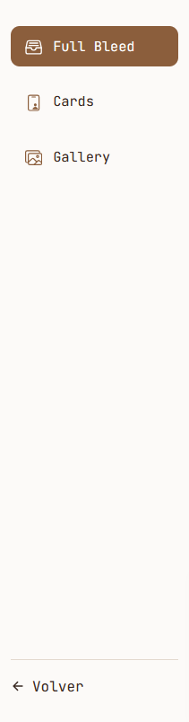
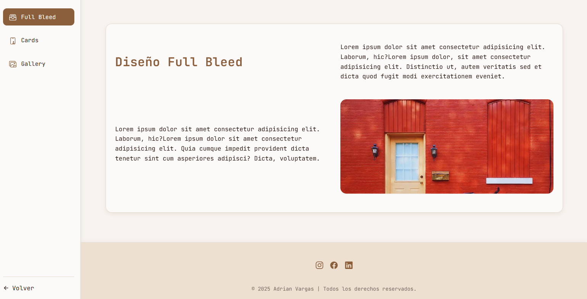
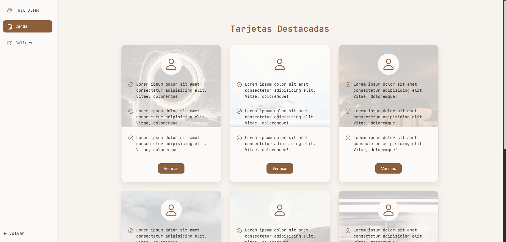
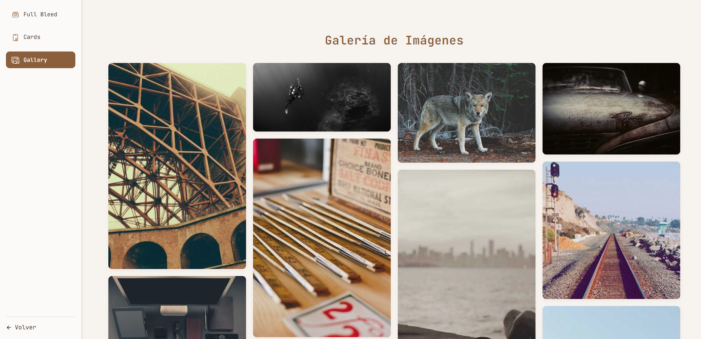
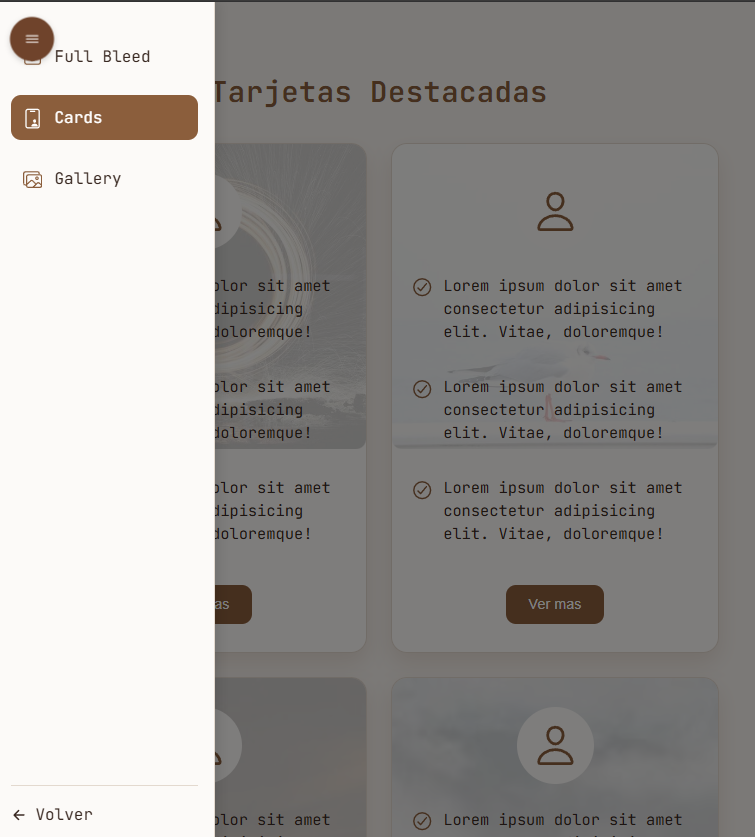
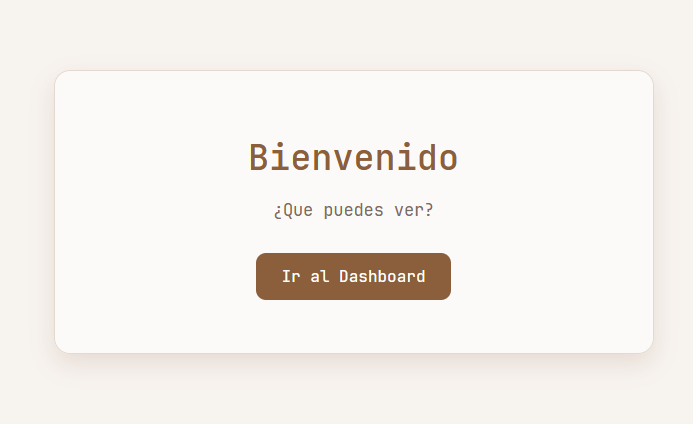

# 🌐 Proyecto Dashboard con GRID CSS

## Hecho por: **Adrián Felipe Vargas Rivera**

Este proyecto es una **página web tipo dashboard** creada con **HTML5, CSS Grid y JavaScript**.  
Su objetivo es demostrar el uso de **layouts modernos con GRID LAYOUT** y **adaptabilidad responsive** para múltiples dispositivos.

Incluye un menú lateral fijo, un sistema de secciones interactivas y un diseño limpio con efectos suaves.

---

## 📸 Capturas de pantalla

| Sección                           | Imagen                               |
| --------------------------------- | ------------------------------------ |
| 🧭 Sidebar con menú activo        |      |
| 🏠 Sección Full Bleed             |  |
| 🧩 Sección Six Cards              |          |
| 🖼️ Galería Responsive             |      |
| ⚙️ Footer con redes               |        |
| 📱 Menú hamburguesa (vista móvil) |        |
| 💻 Página de inicio (grid.html)   |    |

---

## ¿Qué hace este proyecto?

Este dashboard cuenta con **cuatro secciones principales** que pueden visualizarse desde el menú lateral.  
Cada una se muestra dinámicamente al hacer clic, controlado mediante JavaScript.

---

## 1️⃣ Sidebar / Menú lateral

### Descripción:

El sidebar contiene botones para cambiar entre secciones (`Full Bleed`, `Six Cards`, `Gallery`).  
En dispositivos móviles se oculta y se activa con un **menú hamburguesa**.  
En la parte inferior incluye un **botón de “Volver”** que redirige a la pantalla de inicio (`grid.html`).

📌 Implementa **position: fixed** para mantenerse visible, y usa clases `.active` para mostrar/ocultar con transiciones suaves.

---

## 2️⃣ Sección Full Bleed

### Descripción:

Una sección tipo _hero_ de ancho completo con imagen, texto descriptivo y diseño minimalista.  
Utiliza **CSS Grid** para superponer contenido y ajustar la imagen al ancho total de la página.

🎨 Incluye efectos de hover y sombras sutiles para resaltar el contenido.

---

## 3️⃣ Sección Six Cards

### Descripción:

Presenta seis tarjetas con íconos, texto y botones interactivos.  
Organizadas con **CSS Grid**, su distribución cambia automáticamente:

- 🖥️ Escritorio: 3 columnas
- 💻 Tablet: 2 columnas
- 📱 Móvil: 1 columna

Cada tarjeta usa transiciones suaves y sombras para destacar al pasar el cursor.

---

## 4️⃣ Galería de Imágenes

### Descripción:

Una galería responsive implementada con:

```css
grid-template-columns: repeat(auto-fill, minmax(220px, 1fr));
```

Esto permite que las imágenes se **adapten automáticamente** al ancho del contenedor.
También se incluyen **media queries** que reducen progresivamente el tamaño mínimo de las columnas según el dispositivo.

Al pasar el mouse, cada imagen se amplía levemente (`transform: scale(1.05)`).

---

## 5️⃣ Footer

### Descripción:

El pie de página incluye un texto institucional y enlaces a redes sociales con iconos animados.
Su posición se ajusta para no interferir con el sidebar y mantener el diseño balanceado.

📌 Los enlaces estan sin link por el momento.

---

## 💻 Página de Inicio (`grid.html`)

### Descripción:

Una página sencilla con un fondo degradado y un botón central que redirige al dashboard principal (`index.html`).
Para ingresar toca hacer click en el boton de **volver**

---

## ⚙️ JavaScript (`grid.js`)

El archivo `grid.js` controla toda la interacción de la página.

### Funcionalidades:

1. Cambia entre secciones del dashboard usando `data-target`.
2. Activa/desactiva el estado visual de los botones del menú.
3. Controla la apertura/cierre del menú lateral y la superposición (`overlay`) en pantallas pequeñas.

```javascript
document.addEventListener("DOMContentLoaded", () => {
  const buttons = document.querySelectorAll(".menu button");
  const sections = document.querySelectorAll(".section");
  const menuToggle = document.querySelector(".menu-toggle");
  const sidebar = document.querySelector(".sidebar");
  const overlay = document.querySelector(".overlay");

  buttons.forEach((button) => {
    button.addEventListener("click", () => {
      const targetId = button.getAttribute("data-target");
      sections.forEach((s) => s.classList.remove("active"));
      document.getElementById(targetId)?.classList.add("active");
      buttons.forEach((b) => b.classList.remove("active"));
      button.classList.add("active");
      sidebar.classList.remove("active");
      overlay.classList.remove("active");
    });
  });

  menuToggle.addEventListener("click", () => {
    sidebar.classList.toggle("active");
    overlay.classList.toggle("active");
  });

  overlay.addEventListener("click", () => {
    sidebar.classList.remove("active");
    overlay.classList.remove("active");
  });
});
```

---

## 📦 Tecnologías utilizadas

- **HTML5** → Estructura semántica del sitio
- **CSS3 (Grid + Flexbox)** → Diseño responsive moderno
- **JavaScript (ES6)** → Interactividad y manipulación del DOM
- **Ionicons** → Íconos escalables para menú y botones
- **Variables CSS** → Control global de colores, radios y transiciones

---

## 📁 Estructura del proyecto

```
📁 / (raíz)
├── index.html            → Página principal (Dashboard)
│
├── 📁 pages/
│   ├── grid.html         → Página de inicio
│
├── 📁 css/
│   ├── grid_base.css     → Variables globales, colores y tipografía
│   ├── grid_menu.css     → Layout principal y sidebar
│   ├── full_bleed.css    → Sección hero (full bleed)
│   ├── six_cards.css     → Tarjetas interactivas
│   ├── gallery.css       → Galería de imágenes responsive
│   ├── grid_page.css     → Estilos de la página de inicio
│
├── 📁 js/
│   └── grid.js           → Control de navegación y menú lateral
│
└── 📁 images/            → Carpeta con las capturas
```

---

## ✅ Cómo usar

1. Clona o descarga el repositorio:

   ```bash
   git clone https://github.com/tuusuario/proyecto-grid.git
   cd proyecto-grid
   ```

2. Abre el archivo `grid.html` o `index.html` en tu navegador.

3. Ya puedes interactuar con la pagina web.

---

## 🙌 Créditos

Proyecto realizado por **Adrián Felipe Vargas Rivera**

---
